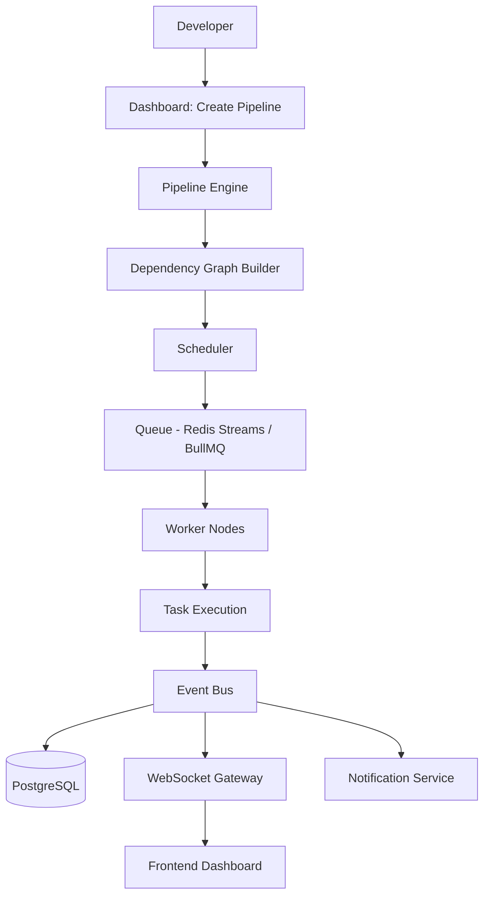

# 02 — System Architecture

## Purpose
Describe the top-level architecture of DevFlow: its major components, how they're deployed, and how data moves through the system end to end.

## Responsibilities
Provide the map every other document references. This is the canonical component diagram.

## Architecture Diagram

## Internal Components
- **Pipeline Engine** — control plane; owns dependency resolution, job scheduling triggers, state management, failure recovery policy.
- **Dependency Graph Builder** — converts a pipeline definition into a validated DAG (cycle detection, unreachable-node detection).
- **Scheduler** — decides *when* and *on which worker* a ready node executes; enforces concurrency limits and priority.
- **Queue** — durable, ordered handoff between Scheduler and Worker Nodes (Redis Streams primary, Kafka as a scale-out alternative).
- **Worker Nodes** — stateless executors; pull/receive jobs, run them in isolated processes/containers, emit results.
- **Event Bus** — the nervous system; every state transition is published here and fanned out to Database, WebSocket Gateway, and Notification Service.
- **WebSocket Gateway** — subscribes to relevant event streams and pushes deltas to connected dashboard clients.
- **Database (PostgreSQL)** — system of record for pipelines, executions, jobs, workers, and audit trail.

## Design Decisions
- **Control plane / data plane separation.** Pipeline Engine never executes user code. This means a compromised or crashing job can't take down scheduling.
- **Event Bus as the integration point**, not direct service-to-service calls. Adding a new consumer (e.g., a future AI failure-analysis service) requires zero changes to existing producers.
- **Queue between Scheduler and Workers**, not direct RPC, so scheduling decisions survive worker restarts and support backpressure naturally.

## Data Flow
1. Developer submits a pipeline definition through the Dashboard.
2. Pipeline Engine hands it to the Dependency Graph Builder, which validates and produces a DAG.
3. Scheduler walks the DAG, enqueuing nodes whose dependencies are satisfied.
4. Worker Nodes consume from the Queue, execute, and publish `job.started` / `job.completed` / `job.failed` events.
5. Event Bus fans events out to Postgres (durability), WebSocket Gateway (real-time UI), and Notification Service.
6. Scheduler consumes completion events to unlock downstream nodes, closing the loop.

## Advantages
Loose coupling via the Event Bus lets frontend, persistence, and notifications evolve independently. Queue-mediated worker communication makes horizontal worker scaling trivial — add workers, they start consuming.

## Trade-offs
Distributed, asynchronous flow is harder to trace than a monolithic runner; requires disciplined correlation IDs and structured logging across every hop (see `21-observability.md`). Eventual consistency between "job actually done" and "UI shows it done" is bounded by WebSocket latency (target < 50 ms) but is never truly zero.

## Edge Cases
- Event Bus outage must not silently drop job-completion events — Postgres write path needs at-least-once delivery with idempotent upserts keyed on job execution ID.
- Scheduler restart mid-pipeline must reconstruct in-flight state from the Database, not from memory.

## Possible Improvements
Multi-region worker pools; pluggable Queue backend (Kafka) for very high-throughput tenants.

## Best Practices
Every event carries `pipelineId`, `executionId`, `jobId`, and a monotonic `sequence` number — this is what makes replay (`34-system-sequence-diagrams.md`) and debugging tractable.

## References
`09-workflow-engine.md`, `13-event-bus.md`, `11-worker-system.md`, `14-websocket-architecture.md`
