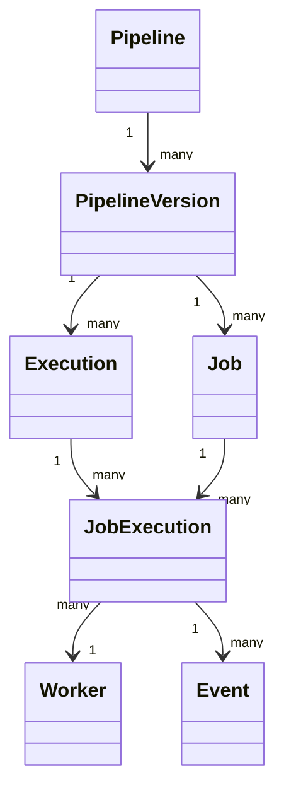

# 06 — Domain Model

## Purpose
Define the core entities of DevFlow and their relationships, independent of database schema or API shape.

## Core Entities
- **Pipeline** — a named, versioned definition of a DAG of jobs. Immutable once an execution starts against a version.
- **PipelineVersion** — a specific snapshot of a Pipeline's DAG definition; executions reference a version, not a mutable pipeline.
- **Execution** — a single run of a PipelineVersion. Has a status (pending, running, succeeded, failed, cancelled) and a timeline of JobExecutions.
- **Job** — a node definition within a Pipeline (e.g., "run tests"), including its type, retry policy, and dependencies.
- **JobExecution** — a single run of a Job within an Execution; the unit that actually maps to work dispatched to a Worker.
- **Worker** — a registered execution node; has health status, capacity, and currently assigned JobExecutions.
- **Event** — an immutable record of a state transition (job started, retried, failed, etc.), the atomic unit flowing through the Event Bus.

## Relationships

## Design Decisions
- **PipelineVersion is a first-class entity**, not a mutable field on Pipeline. This is what makes execution replay meaningful — replaying an old Execution must run against the DAG shape as it existed then, not as it exists now.
- **JobExecution, not Job, is what a Worker executes.** Job is the template; JobExecution is the instance with its own status, logs, retry count, and timing — this separation is what lets the same Job run many times (retries, replays) without entity collisions.

## Advantages
Clean separation between "definition" (Pipeline/Job) and "runtime instance" (Execution/JobExecution) keeps the model honest about what's mutable and what's historical fact.

## Trade-offs
Versioning every pipeline edit adds storage overhead and requires garbage-collection policy for old, unreferenced versions (see `07-database-design.md`).

## Edge Cases
- Editing a Pipeline while an Execution is in flight must not affect that Execution — it's bound to a PipelineVersion, not the live Pipeline.
- Deleting a Pipeline with historical Executions should soft-delete, never hard-delete, to preserve audit/replay integrity.

## Possible Improvements
Add a `PipelineTemplate` entity (future scope) that PipelineVersions can be forked from.

## Best Practices
Never let application code mutate a JobExecution's status directly — status changes only happen as a side effect of consuming an Event (see `16-state-machine.md`), keeping the event log and the row-level status provably consistent.

## References
`07-database-design.md`, `16-state-machine.md`, `09-workflow-engine.md`
