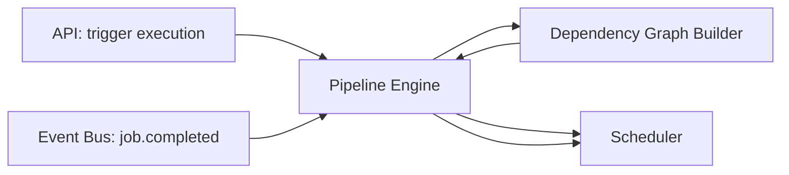

# 09 — Workflow Engine (Pipeline Engine)

## Purpose
The Pipeline Engine is the control-plane brain of DevFlow: it owns dependency resolution, drives job scheduling, tracks execution state, and orchestrates failure recovery. It never executes user workloads itself.

## Responsibilities
- Accept a validated Pipeline definition and produce an executable Execution record.
- Delegate DAG construction to the Dependency Graph Builder.
- Drive the Scheduler by publishing "job ready" signals as dependencies resolve.
- Own the authoritative Execution/JobExecution state machine (see `16-state-machine.md`).
- Apply retry policy on job failure before deciding whether to fail the Execution.

## Design Decisions
- **Stateless engine, stateful store.** The Pipeline Engine holds no long-lived in-memory execution state — every decision is derived by reading Execution/JobExecution rows from Postgres plus recent Events. This means any Engine instance can pick up any Execution, enabling horizontal scaling and crash recovery without complex leader election.
- **Reactive to events, not polling.** The Engine subscribes to the Event Bus for `job.completed`/`job.failed` and reacts, rather than polling the database on a timer — this is what lets us hit sub-200ms pipeline start time and keeps load proportional to actual activity, not to a fixed polling interval.

## Internal Components

## Data Flow
1. `POST /executions` creates an Execution row (status `pending`) and asks the Engine to start it.
2. Engine loads the DAG for the referenced PipelineVersion, identifies root nodes (no dependencies), and asks the Scheduler to enqueue them.
3. Engine subscribes to `job.completed`/`job.failed` events scoped to this Execution.
4. On each completion event, Engine recomputes which downstream nodes are now unblocked and enqueues them.
5. When all nodes reach a terminal state, Engine marks the Execution `succeeded` or `failed` and publishes `execution.completed`.

## Advantages
Reconstructing state from the database rather than memory means an Engine process crash mid-execution loses zero progress — a new Engine instance resumes from wherever the event log left off.

## Trade-offs
Every scheduling decision requires a database read, adding latency versus a pure in-memory scheduler — mitigated by caching the DAG structure (immutable per PipelineVersion) and only re-reading mutable execution status.

## Edge Cases
- **Diamond dependencies** (A→B, A→C, B→D, C→D): D must only be enqueued once both B and C complete — the Engine tracks per-node "pending dependency count," decrementing on each relevant completion event, enqueuing at zero.
- **Duplicate completion events** (delivered twice due to at-least-once delivery) must not double-decrement dependency counts — decrements are idempotent, keyed on `(jobExecutionId, eventId)`.

## Possible Improvements
Priority-aware scheduling hints (allow certain pipelines to preempt queue position) — deferred until multi-tenancy lands.

## Best Practices
The Engine never talks to Workers directly — always through the Scheduler/Queue — preserving the control-plane/data-plane boundary from `02-system-architecture.md`.

## References
`10-dag-execution.md`, `12-scheduler.md`, `16-state-machine.md`, `18-retry-mechanism.md`
