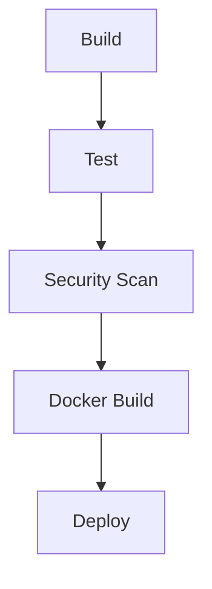
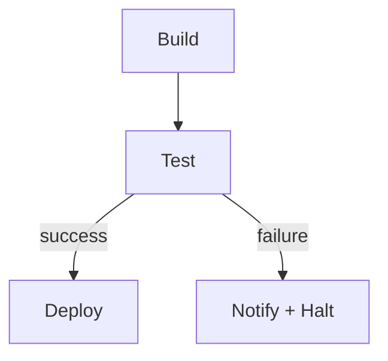

# 10 — DAG Execution

## Purpose
Detail how a Pipeline's DAG definition is validated, compiled, and walked during execution.

## Responsibilities
- Validate DAG structure at authoring time (cycle detection, dangling references).
- Compute execution order respecting dependencies, parallelism, and conditional branches.
- Track per-node readiness during a live Execution.

## Design Decisions
- **Cycle detection via DFS with a recursion stack**, run synchronously on every pipeline save — rejecting cycles at authoring time (422 response, see `08-api-design.md`) is far cheaper than discovering a deadlocked execution at runtime.
- **Topological readiness, not topological order, drives execution.** We don't precompute a single linear order; instead each node tracks an `unresolvedDependencyCount`, decremented as dependencies complete. This naturally supports parallel branches without special-casing them — a node with `unresolvedDependencyCount === 0` is simply ready.

## Internal Components

Conditional branching example:

## Data Flow
1. On save: `graph-engine` package parses the DAG JSON into an adjacency list, runs cycle detection, and validates every `dependsOn` reference resolves to a real node.
2. On execution start: root nodes (zero dependencies) are marked ready and handed to the Scheduler.
3. On each job completion: dependents' `unresolvedDependencyCount` is decremented; any reaching zero become ready.
4. Conditional edges are evaluated against the completed job's exit status/output before deciding whether to decrement the dependent's count at all.

## Advantages
Count-based readiness scales naturally to arbitrary fan-out/fan-in shapes without special algorithmic cases for "parallel" vs "sequential" — it's all the same mechanism.

## Trade-offs
Conditional branching adds a second evaluation step (condition check) on top of pure dependency counting, which slightly increases per-completion-event processing time — acceptable given the sub-20ms scheduling budget still has headroom.

## Edge Cases
- **Orphaned nodes** (no path from any root) are rejected at validation time — a DAG must be fully connected from at least one root to every node, or explicitly marked optional.
- **Self-referencing dependency** (`dependsOn: [ownId]`) is a degenerate cycle case, caught by the same DFS check.
- A node whose *all* dependencies were skipped (not failed, but conditionally skipped) needs an explicit policy: default is "skip downstream too," overridable per-job.

## Possible Improvements
Support dynamic/generated sub-DAGs (fan-out over a runtime-computed list, e.g., "test each changed package") — common in monorepo CI, currently out of scope.

## Best Practices
Keep `graph-engine` pure — no I/O, no database access — so cycle detection and readiness logic can be unit tested exhaustively without spinning up infrastructure.

## References
`09-workflow-engine.md`, `12-scheduler.md`, `06-domain-model.md`
