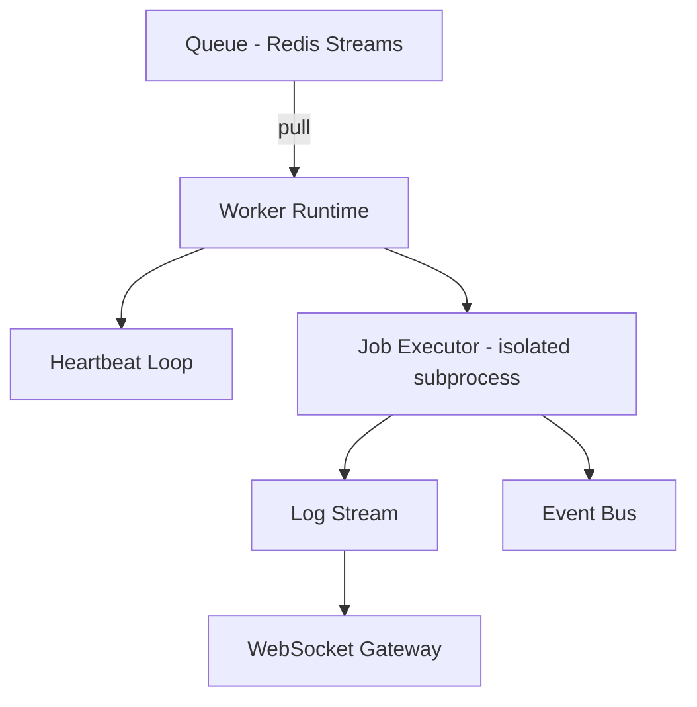

# 11 — Worker System

## Purpose
Define how Worker Nodes are structured, register with the control plane, and execute job types safely and reliably.

## Responsibilities
- Register with the system and emit periodic heartbeats.
- Pull/receive JobExecutions from the Queue matching their capability (build/test/deploy/docker/script).
- Execute the job in an isolated environment, streaming logs as they're produced.
- Report status transitions (`started`, `completed`, `failed`) as events.

## Design Decisions
- **Specialized worker types (`build-worker`, `deploy-worker`, `test-worker`) instead of one generic worker.** Each job type has different resource profiles and security requirements (a deploy worker needs cloud credentials, a test worker doesn't) — specialization keeps least-privilege boundaries clean and lets each worker type scale independently based on its own queue depth.
- **Pull-based consumption from Redis Streams consumer groups**, not push-based dispatch. Workers pull work when they have capacity, which gives natural backpressure — an overloaded worker simply doesn't pull, rather than being force-fed work it can't handle.
- **Each JobExecution runs in an isolated subprocess/container**, never inline in the worker's main event loop — protects the worker process from a runaway or malicious job.

## Internal Components

## Data Flow
1. Worker starts, registers itself (`Worker` row, status `idle`), joins the Redis Stream consumer group for its job type.
2. Worker pulls a JobExecution, publishes `job.started`, spawns an isolated executor.
3. Executor streams stdout/stderr line-by-line to the Event Bus's log topic as it runs.
4. On completion, worker publishes `job.completed` or `job.failed` with exit code/output, acknowledges the Stream message (removing it from the pending list), and returns to `idle`.
5. Heartbeat loop updates `lastHeartbeat` every few seconds; missed heartbeats mark the worker `offline` (see `19-failure-recovery.md`).

## Advantages
Consumer-group pull semantics mean adding worker capacity is just starting more processes — no scheduler-side reconfiguration needed.

## Trade-offs
Pull-based consumption makes it slightly harder to guarantee strict priority ordering across workers versus a centralized push dispatcher — mitigated with priority-aware stream partitioning if/when needed.

## Edge Cases
- **Worker dies mid-job** (process killed, node crashes): the Stream message remains unacknowledged; a claim-timeout process reassigns it to another worker after a grace period (see `19-failure-recovery.md`).
- **Duplicate execution** if a worker is slow to ack but not actually dead: job logic must be idempotent, or execution guarded by a distributed lock keyed on JobExecution ID.

## Possible Improvements
Kubernetes-native worker pools with autoscaling based on queue depth (see `37-future-improvements.md`).

## Best Practices
Workers are stateless and disposable — no worker-local state that would be lost/needed on restart should ever exist outside the currently-executing job.

## References
`12-scheduler.md`, `17-queue-system.md`, `19-failure-recovery.md`, `20-log-streaming.md`
