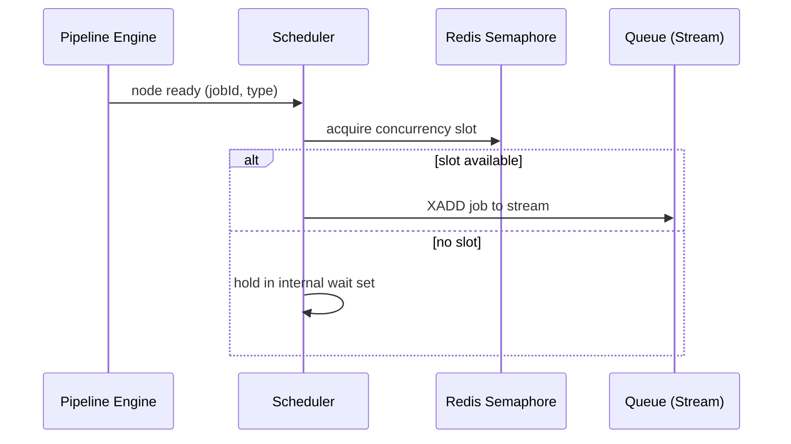

# 12 — Scheduler

## Purpose
The Scheduler decides *when* a ready JobExecution gets enqueued and, implicitly, how concurrency and priority are governed across the whole system.

## Responsibilities
- Receive "node ready" signals from the Pipeline Engine.
- Enforce per-pipeline and global concurrency limits.
- Enqueue JobExecutions onto the correct job-type Stream (build/test/deploy/docker/script).
- Track queue depth and expose it for the Performance Metrics dashboard.

## Design Decisions
- **Scheduler is a thin, stateless layer over the Queue** — it does not itself decide *which worker* runs a job; that's Redis Streams consumer-group semantics. This keeps the Scheduler's job small and testable: given a ready node, pick a stream and concurrency-gate it.
- **Concurrency limits enforced via semaphore counters in Redis**, not in application memory, so limits hold correctly across multiple Scheduler instances running concurrently.

## Internal Components

## Data Flow
1. Pipeline Engine emits a "ready" signal per unblocked node.
2. Scheduler checks the relevant concurrency semaphore (per-pipeline max parallel jobs, global max per job-type).
3. If a slot is free, the JobExecution is written to the appropriate Redis Stream (`XADD`) and the slot is held until the corresponding completion event releases it.
4. If no slot is free, the ready node is held in a short wait set and retried on the next semaphore release.

## Advantages
Redis-backed semaphores make concurrency limits durable and consistent across restarts — a Scheduler crash doesn't silently "forget" that 3 slots were in use.

## Trade-offs
Adds one extra Redis round trip per scheduling decision versus an in-memory counter — well within the 20ms scheduling budget, and worth it for correctness under horizontal scaling.

## Edge Cases
- **Stuck semaphore** if a completion event is lost before releasing its slot — mitigated with a TTL on held slots plus periodic reconciliation against actual in-flight JobExecution rows.
- **Thundering herd** when many nodes become ready simultaneously (e.g., a wide fan-out completes at once) — the wait set processes releases in FIFO order to avoid starvation.

## Possible Improvements
Priority queues per pipeline tier once multi-tenancy exists; fair-share scheduling across tenants.

## Best Practices
Never let the Scheduler make execution decisions based on stale in-memory state — always reconcile against Redis/Postgres as the source of truth for concurrency accounting.

## References
`09-workflow-engine.md`, `17-queue-system.md`, `11-worker-system.md`
