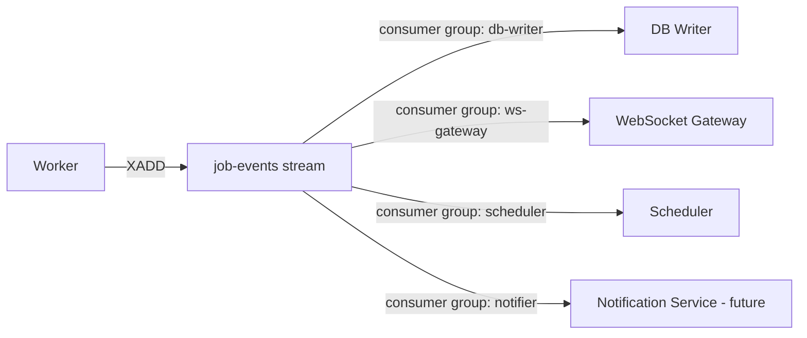

# 13 — Event Bus

## Purpose
The Event Bus is the integration backbone of DevFlow — every meaningful state transition in the system is published here, and every other subsystem (persistence, WebSocket Gateway, notifications) consumes from it rather than being called directly.

## Responsibilities
- Provide a durable, ordered log of every job/execution/worker state transition.
- Support multiple independent consumers reading the same stream without interfering with each other (consumer groups).
- Guarantee at-least-once delivery.

## Design Decisions
- **Redis Streams, not Redis Pub/Sub**, precisely because Streams persist events and support replay — a consumer that's briefly offline (e.g., WebSocket Gateway restart) can resume from where it left off instead of losing events, which Pub/Sub cannot offer.
- **Every event carries `pipelineId`, `executionId`, `jobId`, `eventType`, `sequence`, and `timestamp`.** The `sequence` field (monotonic per JobExecution) is what makes idempotent, order-safe consumption possible even under at-least-once delivery.
- **Topic-per-domain, not one global stream** — separate streams for `job-events`, `worker-events`, `pipeline-events` — so consumers only subscribe to what they need and stream length stays manageable for replay/trim purposes.

## Internal Components

## Data Flow
Producers (Workers, Pipeline Engine) `XADD` events to the relevant stream. Each consumer is its own Redis consumer group, so all four consumers above independently receive every event without competing for it — this is the key property that lets us add the Notification Service later with zero changes to existing consumers.

## Advantages
Decoupling via a durable log means producers never need to know who's listening — this is what allowed `37-future-improvements.md`'s AI Failure Analysis service to be conceptually "just another consumer group" with no core-path changes.

## Trade-offs
Stream length management (trimming old entries) is an operational responsibility that doesn't exist with simpler direct-call architectures — mitigated with `XTRIM` policies once events are durably persisted to Postgres.

## Edge Cases
- **Consumer group lag** — if the DB Writer falls behind, dashboard clients (via WS Gateway) might see state the database hasn't persisted yet; acceptable because WS Gateway reads directly from the stream, not from Postgres, so it isn't blocked by DB Writer lag.
- **Poison messages** (malformed events) are moved to a dead-letter stream after N failed processing attempts rather than blocking the consumer group indefinitely.

## Possible Improvements
Evaluate Kafka once event volume outgrows a single Redis instance's throughput ceiling (see `26-scalability.md`) — the topic-per-domain design translates directly to Kafka topics if that migration happens.

## Best Practices
Consumers must be idempotent with respect to redelivery — never assume an event is processed exactly once.

## References
`02-system-architecture.md`, `14-websocket-architecture.md`, `21-observability.md`
