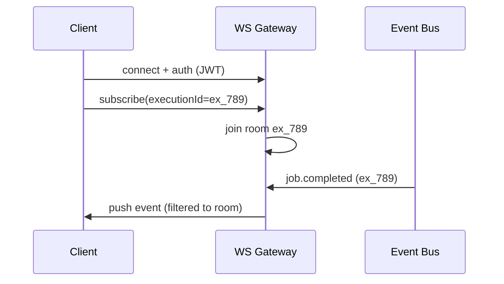

# 14 — WebSocket Architecture

## Purpose
Define the WebSocket Gateway: how clients subscribe to live pipeline/execution/worker state, and how the Gateway scales to 300+ concurrent users at < 50ms latency.

## Responsibilities
- Authenticate WebSocket connections using the same JWT used for REST.
- Manage per-client subscriptions (a client viewing Execution X should only receive events for X, not the whole system).
- Bridge Event Bus consumer groups to individual client connections.
- Handle reconnection/resume without dropping events.

## Design Decisions
- **The Gateway is a dedicated service, not embedded in the API service** (`services/websocket`) — WebSocket connections are long-lived and stateful in a way that's operationally different from stateless REST handlers; isolating them means the API service can be scaled/restarted independently without dropping live connections.
- **Room-based subscription model** (one "room" per `executionId`), so the Gateway only forwards events to clients actually watching that execution — avoids broadcasting irrelevant traffic to every connected client, which is essential at 300+ concurrent users.
- **Gateway is itself a Redis Streams consumer group member**, meaning multiple Gateway instances can run concurrently and each independently receives every event, then filters/forwards to its own locally-connected clients — this is what makes the Gateway horizontally scalable.

## Internal Components

## Data Flow
Client connects and authenticates → subscribes to one or more execution "rooms" → Gateway's Event Bus consumer forwards only matching events to sockets in that room → on disconnect/reconnect, client supplies the last-seen `sequence` number and the Gateway replays missed events from the Stream before resuming live forwarding.

## Advantages
Room-based filtering keeps per-client bandwidth proportional to what they're actually watching, not total system activity — critical at scale.

## Trade-offs
Sticky-session considerations arise if load-balancing WebSocket connections across multiple Gateway instances — mitigated with a stateless reconnect protocol (sequence-based resume) so a client can reconnect to *any* Gateway instance without losing continuity.

## Edge Cases
- **Client subscribes to a completed/archived execution** — Gateway serves the final state snapshot immediately rather than waiting for live events that will never come.
- **Network blip causes rapid reconnect loop** — exponential backoff on the client, plus a brief connection-rate limit per client on the Gateway to prevent thundering reconnects from overwhelming it.

## Possible Improvements
Binary (protobuf) message framing instead of JSON once message volume at scale justifies the added complexity.

## Best Practices
Every WebSocket message includes the `sequence` number it corresponds to, so clients can always detect and request-resume from gaps.

## References
`13-event-bus.md`, `15-realtime-dashboard.md`, `20-log-streaming.md`
