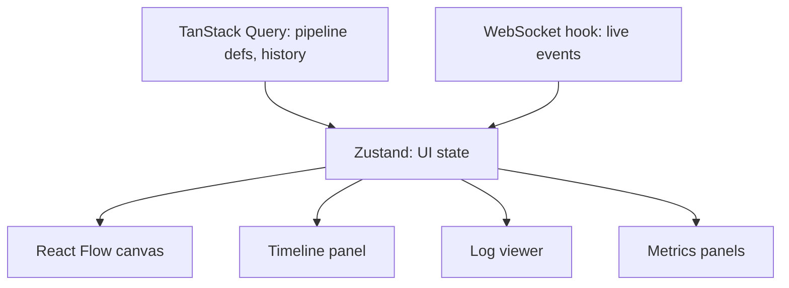

# 15 — Real-Time Dashboard

## Purpose
Define the frontend architecture for the live DAG visualization and status dashboard — the primary surface users interact with.

## Responsibilities
- Render pipeline DAGs interactively (pan/zoom, node inspection) via React Flow.
- Reflect live job/worker/queue state with sub-second freshness.
- Maintain 60 FPS even on graphs with 10,000+ nodes.
- Provide execution timeline, log viewer, and metrics panels.

## Design Decisions
- **React Flow for graph rendering**, not a hand-rolled SVG/canvas layer — gives pan/zoom/minimap/node-selection for free and lets engineering effort focus on DevFlow-specific rendering (status colors, animated edges for active data flow) rather than reinventing graph interaction primitives.
- **TanStack Query for REST-fetched data (pipeline definitions, historical executions), Zustand + a WebSocket hook for live state** — these are deliberately separate stores because they have different consistency models: REST data is cache-and-refetch, live data is push-and-merge. Conflating them into one store makes cache invalidation logic confusing.
- **Viewport virtualization**: only nodes within (or near) the current viewport are mounted as React components; off-screen nodes are represented in the layout calculation but not rendered — this is the single biggest lever for hitting 60 FPS on 10,000+ node graphs, since React reconciliation cost scales with mounted component count, not total node count.

## Internal Components

## Data Flow
Initial load: TanStack Query fetches the PipelineVersion DAG + latest Execution snapshot via REST. WebSocket hook then subscribes to that execution's room and pushes incremental status/log deltas into the same normalized Zustand store React Flow reads from — so REST gives the "photograph," WebSocket gives the "video" layered on top of it.

## Advantages
Separating fetch-cache concerns from live-push concerns means a WebSocket disconnect degrades gracefully to "stale but correct as of last fetch," rather than corrupting UI state.

## Trade-offs
Two state-management systems (TanStack Query + Zustand) add conceptual overhead versus one unified store — justified by how differently REST and WebSocket data need to be reasoned about (cache TTL/invalidation vs. append-only event application).

## Edge Cases
- **Rapid status flapping** (a job oscillating due to a bug) must be visually debounced slightly so the UI doesn't strobe — animate transitions with a minimum visible duration.
- **Extremely wide fan-out** (hundreds of parallel nodes at one DAG level) needs layout algorithm tuning (grouping/clustering) so the graph remains legible, not just performant.

## Possible Improvements
WebGL-based rendering (via a React Flow custom renderer or a dedicated canvas layer) if node counts grow well beyond 10,000 and DOM-based virtualization hits a ceiling.

## Best Practices
Never let a WebSocket event handler perform expensive synchronous work (layout recalculation) directly in the event callback — batch and schedule via `requestAnimationFrame` to protect frame budget.

## References
`14-websocket-architecture.md`, `36-data-flow.md`, `25-performance.md`
