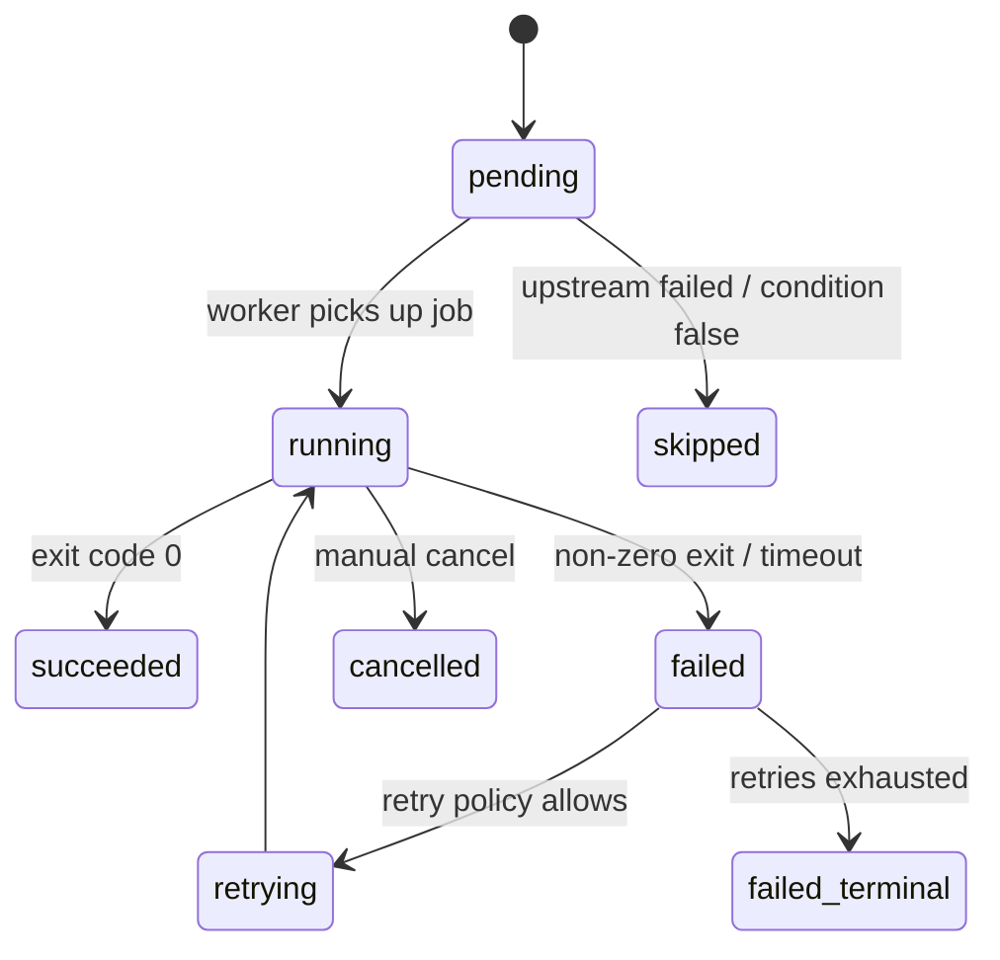
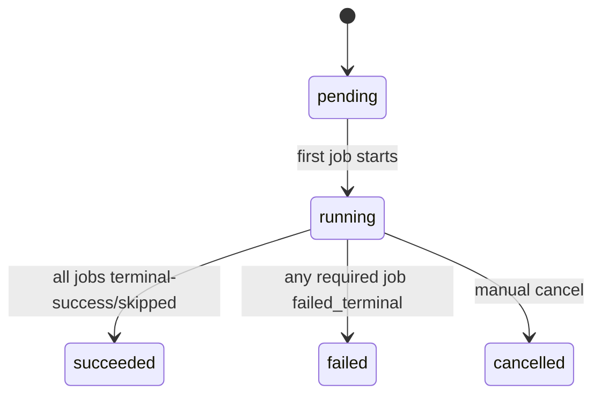

# 16 — State Machine

## Purpose
Define the canonical status lifecycle for Executions and JobExecutions, so status transitions are consistent everywhere they're read or written.

## JobExecution States

## Execution States

## Responsibilities
Provide the single authoritative definition of valid transitions, referenced by the Pipeline Engine (which enforces them) and the Frontend Dashboard (which visualizes them).

## Design Decisions
- **Transitions are only ever applied as a reaction to a consumed Event**, never written directly by application code calling `UPDATE`. This guarantees the event log and the row-level status can never drift — the event log is the cause, the row is the effect.
- **`failed` is distinct from `failed_terminal`.** `failed` is a recoverable, transient state that retry policy may pull back into `retrying`; `failed_terminal` means retries are exhausted and no further automatic recovery will occur. Collapsing these into one `failed` state (a common CI-tool mistake) makes it impossible to distinguish "still trying" from "actually done trying" in the UI.
- **`skipped` is a legitimate terminal state**, not a failure — a node whose upstream conditional branch didn't select it. An Execution with only successes and skips is `succeeded`.

## Data Flow
Event consumed → state-machine validator checks `(currentStatus, eventType) → nextStatus` is a legal transition → row updated → new state re-published as a derived `state.changed` event for the WebSocket Gateway.

## Advantages
Illegal transitions (e.g., `succeeded → running`) are rejected at the state-machine layer, catching event-ordering bugs early instead of corrupting displayed status.

## Trade-offs
Strict transition validation means out-of-order event delivery (rare, but possible under Redis Streams retries) must be explicitly handled — either buffered and reordered by `sequence`, or the illegal transition is logged and dropped rather than silently applied.

## Edge Cases
A JobExecution's retry consumes a *new* `attempt` number but the *same* JobExecution row's status oscillates `failed → retrying → running` — the state machine must accept re-entering `running` from `retrying`, which is intentionally distinct from `pending → running`.

## Possible Improvements
Add a `paused` state for future manual-approval-gate job types.

## Best Practices
Keep the state machine definition in `packages/shared` as a single typed source of truth, imported by both backend validators and frontend status-badge rendering — never duplicate the transition table.

## References
`09-workflow-engine.md`, `18-retry-mechanism.md`, `19-failure-recovery.md`
