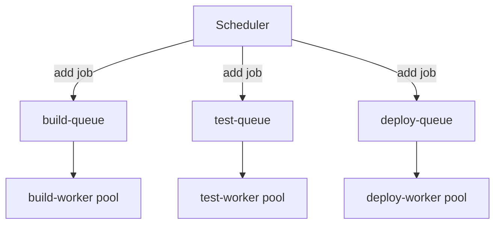

# 17 — Queue System

## Purpose
Detail the queueing layer (BullMQ over Redis, with Redis Streams as the underlying primitive for the Event Bus) that decouples Scheduler decisions from Worker execution.

## Responsibilities
- Provide durable, ordered handoff of JobExecutions from Scheduler to Workers.
- Support per-job-type queues so worker pools can scale independently.
- Provide visibility into queue depth for the observability dashboard.

## Design Decisions
- **BullMQ for job dispatch, Redis Streams for the Event Bus** — two different Redis-backed primitives for two different access patterns. BullMQ gives us job-queue ergonomics out of the box (delayed jobs, backoff, per-job retries) for the Scheduler→Worker hop; Streams gives us multi-consumer durable fan-out for the Event Bus. Using one Redis instance for both keeps operational surface area small while respecting that these are genuinely different problems.
- **One BullMQ queue per job type** (`build-queue`, `test-queue`, `deploy-queue`, `docker-queue`, `script-queue`) rather than one shared queue with a type field — this lets us independently rate-limit and scale worker pools per type, and lets `deploy-queue` (often requiring more careful concurrency control) be configured more conservatively than `test-queue`.

## Internal Components

## Data Flow
Scheduler adds a job to the type-appropriate queue with metadata (JobExecution ID, retry policy, priority). BullMQ workers (one process pool per queue) pick up jobs respecting configured concurrency, execute via the isolated Job Executor (`11-worker-system.md`), and BullMQ marks the job complete/failed based on the executor's outcome — which also triggers the corresponding Event Bus publish.

## Advantages
BullMQ's built-in exponential backoff and dead-letter handling means we don't have to hand-roll retry timing logic — we configure policy, not implementation.

## Trade-offs
Running both BullMQ and raw Redis Streams on the same Redis instance means capacity planning must account for both workloads together — mitigated by moving to separate Redis instances (or Redis Cluster) once either workload's throughput approaches the shared instance's ceiling.

## Edge Cases
A queue with zero available workers (all offline) must surface as a visible "stalled" state on the dashboard, not fail silently — queue-depth-vs-active-worker-count is monitored explicitly (see `28-monitoring.md`).

## Possible Improvements
Priority lanes within each per-type queue once multi-tenant fairness matters.

## Best Practices
Every queued job has a bounded max-attempts and a dead-letter destination — no job retries forever.

## References
`12-scheduler.md`, `11-worker-system.md`, `18-retry-mechanism.md`
