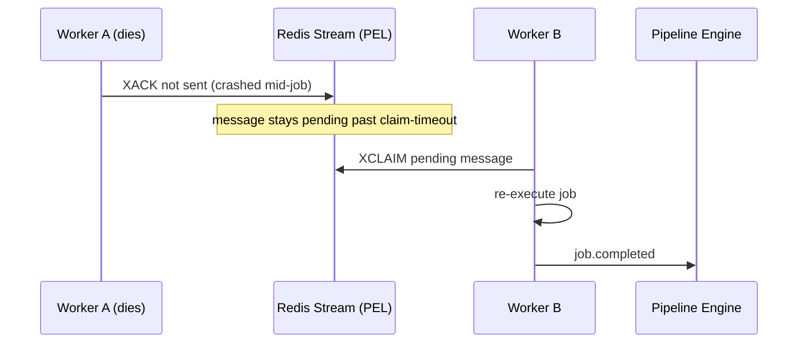

# 19 — Failure Recovery

## Purpose
Define system-level recovery behavior — worker crashes, network partitions, stalled queues — as distinct from job-level retry policy (`18-retry-mechanism.md`).

## Responsibilities
- Detect worker failure (missed heartbeats) and reassign in-flight work.
- Distinguish "job failed" from "worker failed while running a job" — the latter is not a job failure, it's an infrastructure failure, and must not consume a retry attempt from the job's own policy budget by default.
- Support manual recovery actions: skip failed step, restart from failed node, restart entire pipeline.

## Design Decisions
- **Heartbeat-based failure detection**, not TCP-connection-based — workers may be behind load balancers or NAT where connection state isn't a reliable liveness signal. A worker missing 3 consecutive heartbeat intervals (configurable) is marked `offline`.
- **Redis Streams' consumer-group pending-entries list (PEL) claim mechanism** handles reassignment: an unacknowledged message older than a claim-timeout is claimed by another consumer (worker) in the group automatically — no custom reassignment logic needed, we lean on the primitive Streams already provides.
- **Worker-failure-induced job failure is retried transparently** (doesn't count against the job's `maxAttempts`) up to a small separate infra-retry budget — a job shouldn't "burn" its legitimate retry attempts because the worker it happened to land on died.

## Internal Components

## Data Flow
Heartbeat monitor (a lightweight background job) scans `Worker` rows for stale `lastHeartbeat`, marks them `offline`, and publishes a `worker.offline` event. Any JobExecution still `running` on that worker is identified and its Stream message becomes eligible for claim-timeout reassignment.

## Manual Recovery Actions
- **Skip failed step** — mark the JobExecution `skipped` by user action, allow downstream nodes with non-strict dependency policy to proceed.
- **Restart from failed node** — create a new Execution attempt that reuses successful upstream JobExecution results and re-runs only from the failed node forward.
- **Restart entire pipeline** — full new Execution against the same PipelineVersion.

## Advantages
Leaning on Redis Streams' native claim mechanism instead of building custom reassignment logic reduces the surface area for distributed-systems bugs.

## Trade-offs
Claim-timeout introduces a recovery-latency floor — a crashed worker's job isn't retried until the timeout elapses, trading faster-failure-detection for avoiding false positives on merely-slow workers.

## Edge Cases
Two workers briefly both believing they own a claimed job (race at claim-timeout boundary) is prevented by Streams' atomic `XCLAIM`, but downstream idempotency (per `18-retry-mechanism.md`) is still required as defense in depth.

## Possible Improvements
Predictive worker-health scoring (CPU/memory trend) to proactively drain a worker before it fully fails.

## Best Practices
Never treat "no heartbeat" as instant failure — always apply a grace period sized well above normal network jitter.

## References
`11-worker-system.md`, `17-queue-system.md`, `18-retry-mechanism.md`
