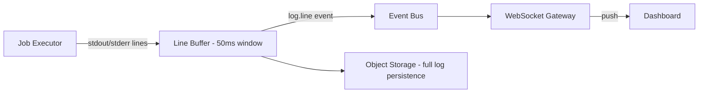

# 20 — Log Streaming

## Purpose
Define how worker log output reaches the dashboard live, with no manual refresh, at the target < 50ms WebSocket latency.

## Responsibilities
- Capture stdout/stderr from job executor subprocesses line by line.
- Deliver log lines to subscribed dashboard clients in near real time.
- Persist full logs for later viewing/replay without requiring an active WebSocket connection.

## Design Decisions
- **Logs are treated as a special high-volume event type on the Event Bus**, not a separate system — `log.line` events flow through the same Redis Streams infrastructure as job status events, keyed by `jobExecutionId`, so the WebSocket Gateway subscribes to one unified stream per execution rather than juggling two systems.
- **Line-buffered, not byte-buffered, streaming** — the executor flushes complete lines as they're written, batching very rapid output (e.g., a noisy test runner) into small chunks (e.g., 50ms windows) to avoid overwhelming the WebSocket connection with a message-per-character pattern.
- **Logs persisted to object storage (not Postgres) for the full-text body**, with only line count/pointer metadata in Postgres — keeps the relational database free of large blob writes, which would hurt query performance on the hot Execution/JobExecution tables.

## Internal Components

## Data Flow
Executor writes lines → buffered and batched → published as `log.line` events (with `jobExecutionId`, `lineNumber`, `timestamp`) → WebSocket Gateway forwards to any client currently viewing that execution → in parallel, the same buffered batches are appended to an object-storage log file for durable, replayable access after the fact.

## Advantages
Reusing the Event Bus for logs avoids inventing a parallel real-time delivery mechanism — one WebSocket subscription model serves both status and log updates.

## Trade-offs
Batching introduces a small, bounded latency (up to the batch window) versus true per-line push — acceptable given the 50ms target is a budget, not a hard real-time guarantee, and batching meaningfully reduces message overhead under high-throughput logging.

## Edge Cases
- **Client connects mid-execution**: on subscribe, the Gateway first replays already-buffered/persisted lines from the current position before switching to live tailing, so the client never sees a gap.
- **Extremely verbose jobs** (e.g., accidental infinite loop with prints) need a per-execution log-volume cap to protect object storage costs and Gateway memory — logs beyond the cap are truncated with a clear "log truncated" marker, execution itself is not affected.

## Possible Improvements
Structured log support (JSON lines) with client-side filtering/search, rather than plain text streaming.

## Best Practices
Never block job execution on log delivery — log streaming is fire-and-forget from the executor's perspective; a slow/disconnected dashboard client must never slow down the running job.

## References
`13-event-bus.md`, `14-websocket-architecture.md`, `11-worker-system.md`
