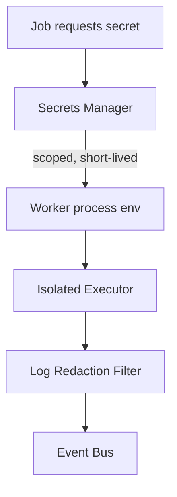

# 22 — Security

## Purpose
Define the security model spanning authentication, authorization, job execution isolation, and secrets handling.

## Responsibilities
- Protect API and WebSocket surfaces from unauthorized access.
- Isolate untrusted job execution (user-defined scripts) from the host and from each other.
- Manage secrets (deploy credentials, API keys referenced in pipelines) without exposing them in logs or the database in plaintext.

## Design Decisions
- **Job execution isolation via containers/subprocesses with restricted privileges** (see `11-worker-system.md`) — a pipeline's "custom script" job type runs user-authored code, which must be treated as untrusted by default: no host filesystem access beyond a scoped workspace directory, no arbitrary network egress unless explicitly granted per job.
- **Secrets referenced by name, resolved at execution time, never stored in pipeline definitions** — a pipeline says `uses: secrets.DEPLOY_KEY`, and the actual value is injected into the worker's environment only for the duration of that job, fetched from a secrets manager rather than persisted in the `dagJson` blob (`07-database-design.md`).
- **Log redaction for known secret values** — any log line containing a value matching a currently-injected secret is redacted before being persisted or streamed, protecting against accidental `echo $DEPLOY_KEY` leaks.

## Internal Components

## Advantages
Never persisting secret values in the pipeline definition means a leaked/exported pipeline JSON is not itself a credential leak.

## Trade-offs
Redaction is pattern-based and cannot catch every possible secret leakage vector (e.g., a secret transformed/encoded before printing) — this is a defense-in-depth layer, not a substitute for least-privilege secret scoping.

## Edge Cases
A worker crash mid-job must not leave secret values persisted in a core dump or temp file beyond the job's isolated workspace, which is wiped on job completion regardless of success/failure.

## Possible Improvements
Per-pipeline secret scoping with an approval workflow (multi-tenant RBAC prerequisite, see `37-future-improvements.md`).

## Best Practices
Principle of least privilege for every job type: `test-worker` never has deploy credentials available, even if a test job's script tried to request them — scoping is enforced by job *type*, not by the script's own request.

## References
`23-authentication.md`, `24-authorization.md`, `11-worker-system.md`
