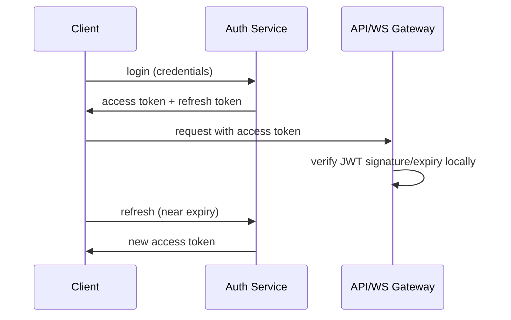

# 23 — Authentication

## Purpose
Define how users and API clients authenticate to DevFlow's REST and WebSocket surfaces.

## Responsibilities
- Issue and validate short-lived access tokens plus longer-lived refresh tokens.
- Authenticate both REST requests and WebSocket upgrade handshakes with the same identity model.

## Design Decisions
- **JWT access tokens (short-lived, ~15 min) + opaque refresh tokens (longer-lived, stored server-side, revocable)** — JWTs let every service validate a request without a database round trip (fast, horizontally scalable), while the revocable refresh token gives us a way to actually kill a compromised session, which pure long-lived JWTs can't do without a blocklist.
- **WebSocket auth via the same JWT**, passed during the initial connection handshake (query param or first message) rather than per-message — validated once at connect time, consistent with treating the whole connection as one authenticated session tied to a room subscription model (`14-websocket-architecture.md`).

## Internal Components

## Data Flow
Login issues both tokens. The access token is attached to every REST call and the WebSocket handshake. When it nears expiry, the client silently calls the refresh endpoint using the refresh token to obtain a new access token, avoiding forced re-login during an active session (including mid-execution monitoring).

## Advantages
Local JWT verification (no DB hit per request) keeps API and WS Gateway latency low, directly supporting the < 50ms WebSocket and general API latency targets.

## Trade-offs
JWTs can't be instantly revoked mid-lifetime (only refresh tokens can) — mitigated by keeping access-token lifetime short, bounding the exposure window of a compromised access token.

## Edge Cases
A WebSocket connection whose access token expires mid-session must prompt the client to refresh and re-authenticate the socket (reconnect with new token) rather than silently continuing on an expired credential — enforced server-side by re-checking expiry on a timer, not just at initial handshake.

## Possible Improvements
SSO/OIDC integration once DevFlow supports multi-tenant organizations.

## Best Practices
Refresh tokens are single-use and rotated on every refresh, detecting token replay/theft.

## References
`22-security.md`, `24-authorization.md`, `08-api-design.md`
