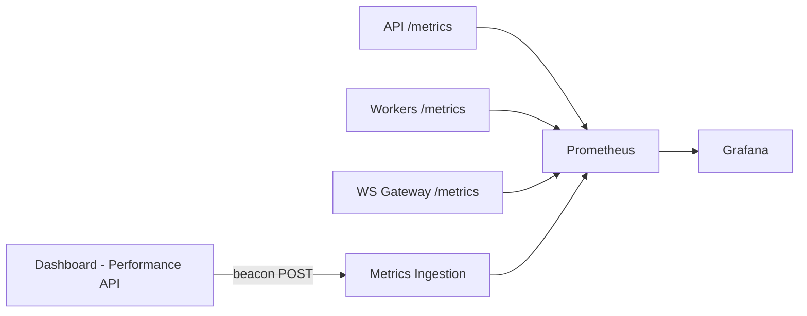

# 28 — Monitoring

## Purpose
Define what DevFlow measures about itself and how it's exposed via Prometheus/Grafana, directly implementing the Production Metrics Dashboard from the original spec.

## Responsibilities
Expose and visualize five metric categories: pipeline, worker, performance, real-time, and frontend metrics.

## Metric Categories

**Pipeline Metrics** — total / running / failed / successful pipelines (Prometheus counters/gauges, scraped from the API service).

**Worker Metrics** — active workers, idle workers, CPU usage, memory usage (scraped from each worker's `/metrics` endpoint, node-level resource stats via a lightweight exporter).

**Performance Metrics** — queue length, throughput, average execution time, retry count, deployment time (derived from Event Bus events and BullMQ queue introspection).

**Real-Time Metrics** — WebSocket connections, messages/sec, event processing rate, latency, pipeline duration (scraped from the WebSocket Gateway and Event Bus consumer lag).

**Frontend Metrics** — FPS, graph render time, React render count, bundle size, memory consumption (collected client-side via the Performance API and reported through a lightweight beacon endpoint, since Prometheus can't scrape a browser directly).

## Design Decisions
- **Prometheus pull model for backend services, push beacon for frontend metrics** — Prometheus's scrape model doesn't fit browser clients, so frontend metrics are batched and POSTed periodically to a small ingestion endpoint that re-exposes them as Prometheus metrics server-side, keeping Grafana as the single pane of glass for both.
- **Every service exposes `/metrics` in Prometheus exposition format** rather than a custom JSON schema — standard tooling, standard alerting, no bespoke parsing.

## Internal Components

## Advantages
A single Prometheus/Grafana stack covering both backend and frontend metrics means one alerting system, one dashboard tool, one on-call runbook surface.

## Trade-offs
Client-side beaconing adds a small amount of network chatter from every connected dashboard — mitigated by batching and a conservative reporting interval (e.g., every 10s, not per-frame).

## Edge Cases
Frontend metrics from a client with a broken connection never arrive — acceptable, since the goal is aggregate fleet visibility, not per-session completeness guarantees.

## Possible Improvements
Distributed tracing (OpenTelemetry) layered on top of these metrics for request-level latency breakdown (see `21-observability.md`).

## Best Practices
Every new feature ships with at least one new metric if it introduces a new failure mode or throughput-relevant path — metrics are part of the definition of done, not an afterthought.

## References
`21-observability.md`, `25-performance.md`, `03-requirements.md`
