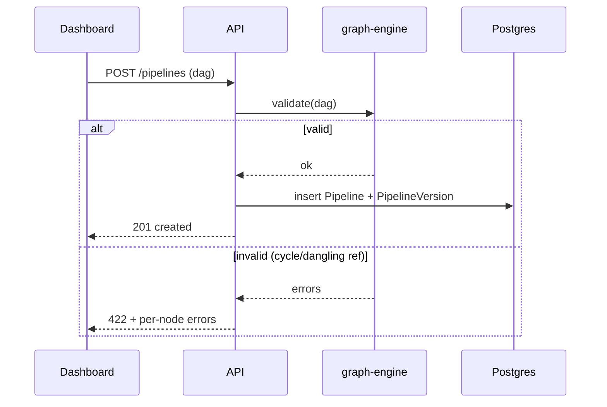
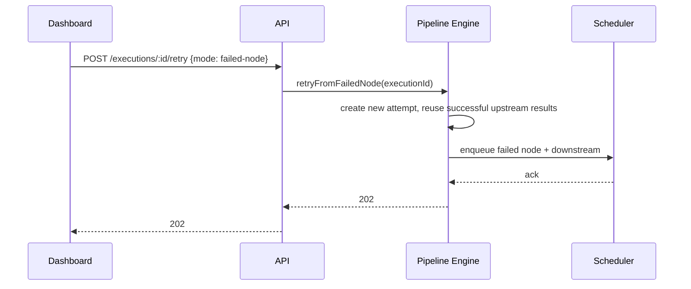
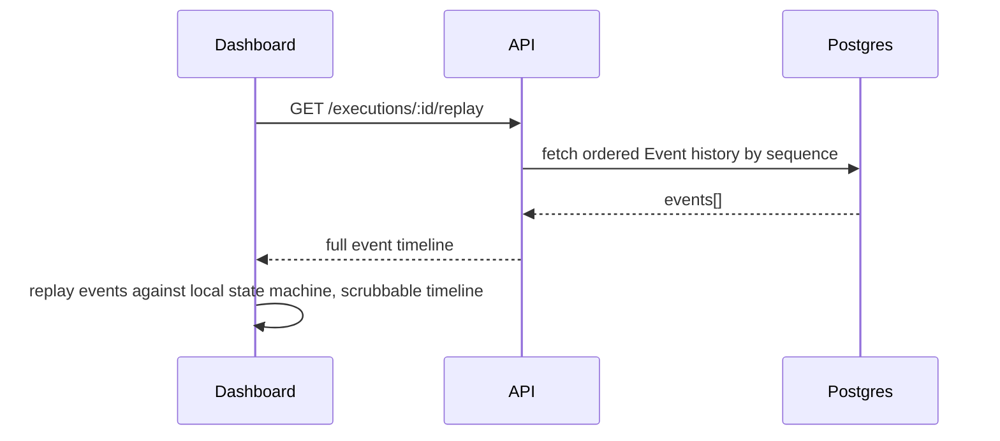

# 34 — System Sequence Diagrams

## Purpose
Collect the key cross-component sequences in one reference document, complementing the single end-to-end trace already covered in `36-data-flow.md`.

## Sequence: Pipeline Creation & Validation

## Sequence: Manual Retry (Restart From Failed Node)

## Sequence: Worker Failure & Reassignment
See `19-failure-recovery.md` for the full sequence diagram — reproduced here by reference to avoid divergent copies of the same diagram.

## Sequence: Execution Replay

## Design Decisions
Replay is implemented as **client-side event replay against the persisted event history**, not as a special "re-execute against workers" mode — this keeps replay cheap, safe (no risk of accidentally re-triggering real jobs), and instant, since it's just re-running the same state-machine logic the live dashboard already uses, against historical rather than live events.

## Advantages
Reusing the exact same state-machine transition logic for both live and replayed executions guarantees the replayed view is never inconsistent with how the live view originally rendered — one code path, two data sources.

## Trade-offs
Replay requires full event history retention for the replay window desired — directly informs the Event Bus / Postgres retention policy (`13-event-bus.md`, `07-database-design.md`).

## Edge Cases
Replaying an execution whose PipelineVersion has since been deleted (soft-deleted, per `06-domain-model.md`) must still work — replay reads from the historical Event records, which are self-contained and don't require the live PipelineVersion to still exist.

## Possible Improvements
Side-by-side replay comparison (diff two executions' timelines) for regression analysis.

## Best Practices
Every new state-machine transition type must be replayable using the same client logic — no "replay only supports these older event types" exceptions.

## References
`36-data-flow.md`, `19-failure-recovery.md`, `16-state-machine.md`
