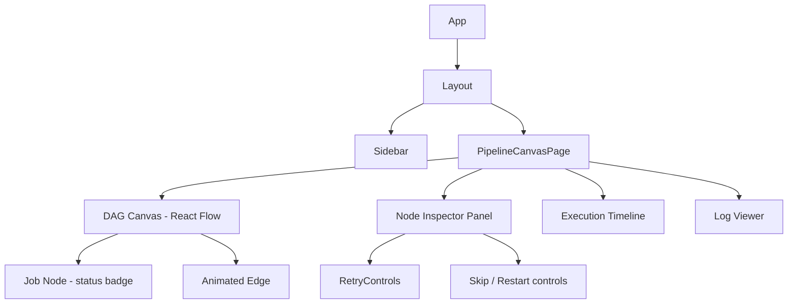

# 35 — Component Diagrams (Frontend)

## Purpose
Break down the Dashboard app's component tree and show how state flows into each part of the UI.

## Component Tree

## Responsibilities
- **DAGCanvas** — renders the graph, handles pan/zoom/selection, delegates node styling to status.
- **JobNode** — a memoized leaf component; re-renders only when its own status changes, not on unrelated store updates.
- **Inspector** — shows details (logs preview, retry policy, timing) for the currently selected node; hosts manual recovery actions from `19-failure-recovery.md`.
- **Timeline** — horizontal execution timeline (Task Started → Completed → Retry → Failure → Recovery → Deployment Success), scrubbable to inspect historical state during replay.
- **LogViewer** — tails `log.line` events for the selected JobExecution.

## Design Decisions
- **Per-node memoization keyed on `(jobId, status, updatedAt)`** is what prevents a single status update from re-rendering the entire 10,000-node graph — each `JobNode` subscribes narrowly to its own slice of the Zustand store via a selector, not the whole store.
- **Inspector and DAGCanvas are decoupled** — clicking a node updates `selectedNodeId` in the store; both components independently react to that, so neither owns the other, simplifying testing.

## Data Flow
Store updates (from WebSocket or TanStack Query) flow down via selectors; user actions (select node, trigger retry) flow up as store mutations or API calls, never as direct prop-drilled callbacks across more than one level.

## Advantages
Narrow selector subscriptions are the primary defense against unnecessary re-renders at scale — this is a direct requirement of the 60 FPS / 10,000-node target from `03-requirements.md`.

## Trade-offs
Fine-grained selectors add boilerplate per component versus one large context object — worth it given render-count is an explicitly monitored frontend metric (`28-monitoring.md`).

## Edge Cases
Selecting a node that gets deleted/invalidated mid-session (e.g., pipeline edited elsewhere) must gracefully clear `selectedNodeId` rather than render a broken Inspector.

## Possible Improvements
Extract `DAGCanvas` into a standalone `packages/ui` component once a second consumer (e.g., a future embeddable widget) needs it.

## Best Practices
Every component that reads live data uses a Zustand selector, never the whole-store hook, to keep re-render surface minimal.

## References
`15-realtime-dashboard.md`, `36-data-flow.md`, `25-performance.md`
