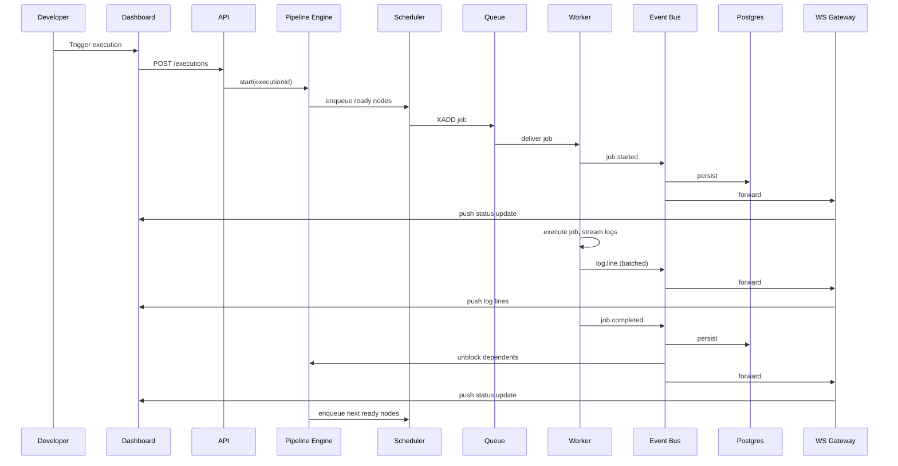

# 36 — Data Flow (End-to-End)

## Purpose
Trace a single job's data as it moves through every layer of DevFlow, tying together the backend documents (Phase 2) and frontend documents (Phase 3) into one coherent path.

## Full Sequence

## Responsibilities
This document exists purely as an integration reference — it does not introduce new components, only shows how documents 08 through 20 and 14–15 compose into one observable path.

## Design Decisions
The Event Bus fan-out (to DB, WS Gateway, and back to the Engine) happening from a *single* published event, rather than three separate direct calls from the Worker, is the crux of the whole architecture's decoupling — the Worker publishes once and knows nothing about who consumes it.

## Advantages
Because every hop in this diagram is either a durable queue write or an idempotent event consumption, the same sequence is naturally replayable — this is what `34-system-sequence-diagrams.md` and execution replay build on directly.

## Trade-offs
End-to-end latency is the sum of several asynchronous hops (Scheduler→Queue→Worker→EventBus→WSGateway→Client) rather than one direct call — each hop is individually fast (ms-level), and the sum is what the < 200ms pipeline-start and < 50ms WebSocket-latency budgets in `03-requirements.md` are built to protect.

## Edge Cases
If any hop between `job.completed` and `WS Gateway push` is delayed, the frontend may briefly show a job as `running` slightly after it has actually finished on the backend — bounded by the Event Bus and Gateway's own latency budgets, and acceptable as eventual (not immediate) consistency.

## Possible Improvements
Add distributed tracing (OpenTelemetry) spans across this exact sequence so any single execution's real end-to-end latency breakdown is directly queryable (see `21-observability.md`).

## Best Practices
Any new feature that needs to react to job state should be added as a new Event Bus consumer group, following this diagram's fan-out pattern — never by adding a new direct call from the Worker.

## References
`02-system-architecture.md`, `13-event-bus.md`, `14-websocket-architecture.md`, `34-system-sequence-diagrams.md`
